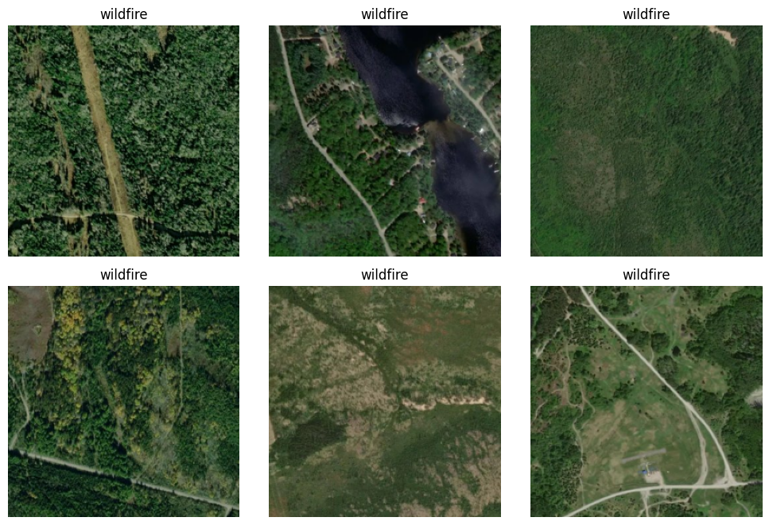

# Wildfire Whackers: Wildfire Prediction Models
## DS4420 Final Project  
Team Members: Ella Chee, Willbert Clement Christianto, Khushi Khan

### Overview:
We experimented with three types of deep learning approaches (multi-layer perceptron, convolutional neural network, and Bayesian machine learning) to categorize Canadian satellite images from [Kaggle](https://www.kaggle.com/datasets/abdelghaniaaba/wildfire-prediction-dataset) as at risk or not at risk of wildfire. Below is a subset of our training dataset samples:

<div align="center">
  
</div>

Visit our website for more details: https://wildfire-whackers.streamlit.app/

### Model Usage: 
1. Clone and navigate to the repository.
```bash
git clone https://github.com/khushikhan0/ds4420_project.git
cd ds4420_project
```
2. Download the required packages.
```bash
pip install -r requirements.txt
```
4. Download the data.
```bash
download_data.py
```
3. Load the CNN model with the following line:
```bash
model = keras.models.load_model('./cnn/cnn_model.keras')
```
